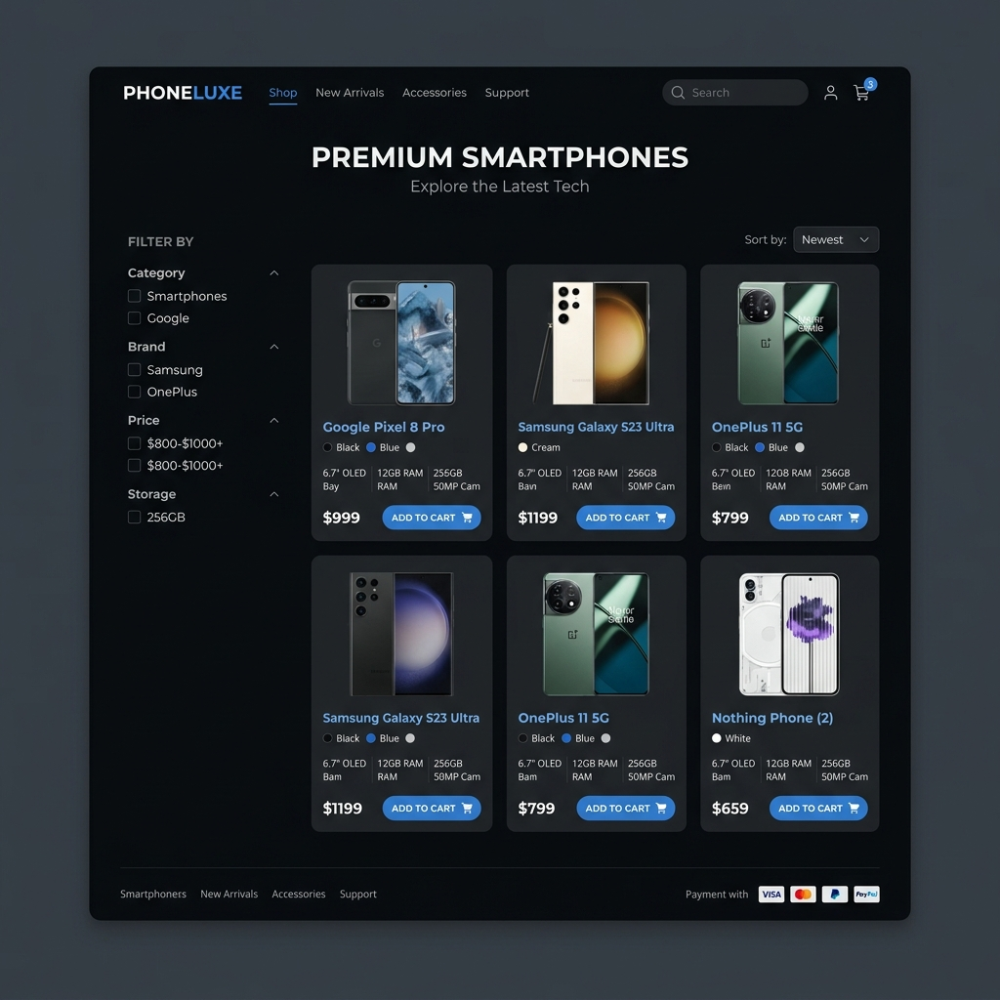

# Obachi Mobile Shop 📱

Hey! 👋 This is Obachi Mobile Shop, a responsive storefront I designed for an online mobile phone shop. I built this to master Bootstrap grid systems, product filter logic with jQuery/Isotope, and frontend cart additions.

## 📸 Preview

## Why I built this
I wanted to build a complete frontend e-commerce storefront. The focus here was creating a clean, modern grid where customers can browse phones (like iPhones and Samsung Galaxy devices), filter them by category (e.g., brand, price, new arrivals), and add them to a cart with immediate UI updates. Handling the jQuery state for isotope item layouts and styling the dark mode product cards were the most fun parts!

## Features
- Dynamic product listing grid with category filter tabs (Isotope integration)
- Interactive sliding banner carousel for featured promotions
- Client-side shopping cart drawer (add items, calculate totals, delete items)
- Beautiful product detail layout modal
- Styled responsive Bootstrap cards with hover zoom effects

## Tech Stack
- **Framework:** Bootstrap 4 (Responsive grid and widgets)
- **Library:** jQuery, Isotope (for smooth animated filtering)
- **Styling:** Custom SASS (compiled to CSS)

## Known Issues (// TODOs)
- **Checkout Payment:** The checkout flow only collects basic delivery details and isn't connected to a live gateway. Adding a card/M-Pesa payment portal is next.
- **Search bar:** The search bar doesn't filter items in real-time yet; only the category tabs work.
- **Data Hydration:** Migrate the static product array to fetch data dynamically from an API.

## Setup Instructions

To open this website locally:

1. Clone this repository
2. Run `npm install` (if you want to compile SASS changes) or just open `index.html` directly in any web browser!

Peace! ✌️
